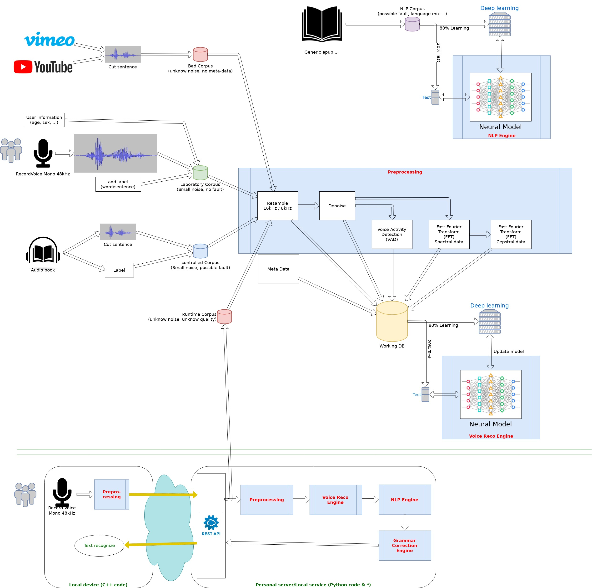

Research theme and ideas:
=========================

Some usefull library:
=====================

Voice Activity Detection (VAD): https://github.com/jtkim-kaist/VAD
Audio Denoise: https://github.com/jtkim-kaist/Speech-enhancement
Natural Language Processing (NLP): https://github.com/zalandoresearch/flair

ideas of architeture:
=====================

Final library objective:
========================

